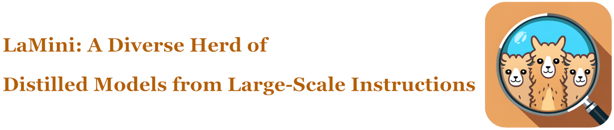
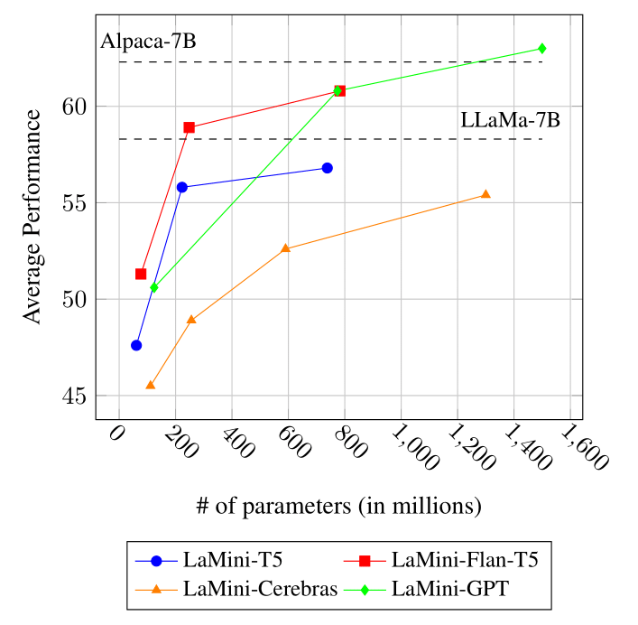
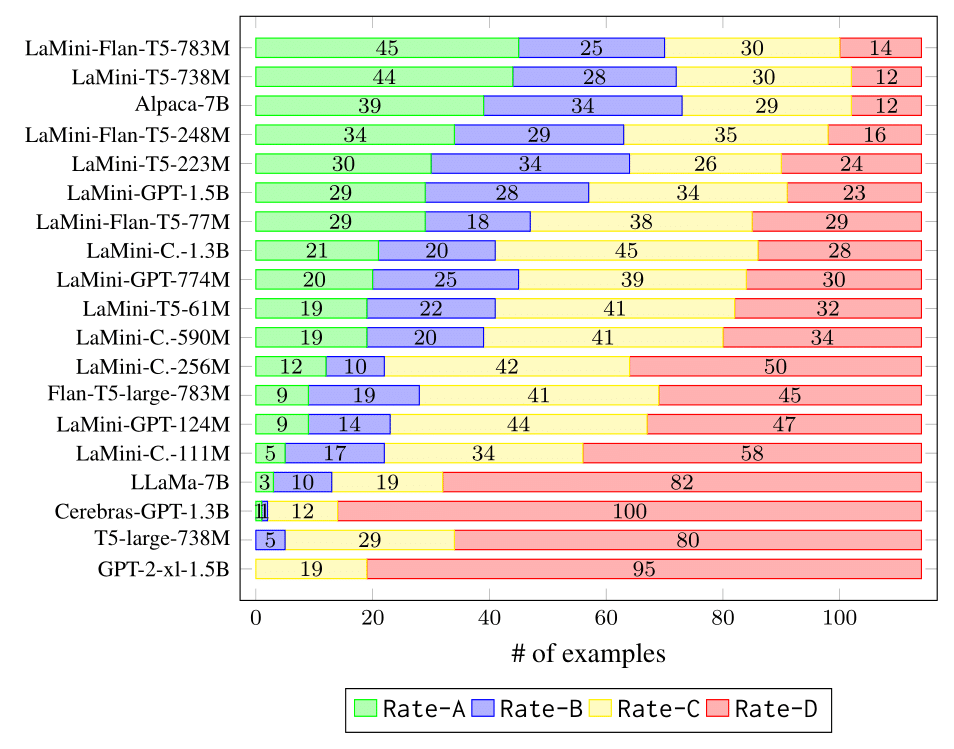

<p align="center" width="100%">
    <a></a>
</p>

# LaMini: A Diverse Herd of Distilled Models from Large-Scale Instructions

[](https://github.com/tatsu-lab/stanford_alpaca/blob/main/LICENSE)
[](https://github.com/tatsu-lab/stanford_alpaca/blob/main/DATA_LICENSE)


This repo is for MBZUAI LaMini project. We create efficient, smaller distilled models by generating a large dataset, exploring different architectures, and extensively evaluating their performance. 
<!-- TOC -->

- [Data](#data)
- [Models](#models)
- [Evaluation](#evaluation)
    - [NLP Evaluation](#nlp-evaluation)
    - [Human Evaluation](#human-evaluation)
- [Citation](#citation)

<!-- /TOC -->

## Data

We distill the knowledge from large language models by performing sentence/offline distillation (Kim and Rush, 2016). We generate a total of **2.58M** pairs of instructions and responses using [`gpt-3.5-turbo`](https://openai.com/api/) based on several existing resources of prompts, including [self-instruct](https://github.com/yizhongw/self-instruct) (Wang et al., 2022), [P3](https://huggingface.co/datasets/bigscience/P3) (Sanh et al., 2022), [FLAN](https://github.com/google-research/FLAN) (Longpre et al., 2023) and [Alpaca](https://github.com/tatsu-lab/stanford_alpaca) (Taori et al., 2023). More information about the process for generating our instruction dataset, please refer to Section 3 in [our paper]().

We release our data [HERE](https://huggingface.co/datasets/MBZUAI/LaMini-instruction). 

## Models

You can download LaMini model series as follow. Note that not all models are performing as well. Models with ✩ are those with the best overall performance given their size/architecture. More details can be seen in our paper. 

<table>
<thead>
  <tr>
    <th>Base model</th>
    <th colspan="4">LaMini series (#parameters)</th>
  </tr>
</thead>
<tbody>
  <tr>
    <td>T5</td>
    <td><a href="https://huggingface.co/MBZUAI/lamini-t5-61m" target="_blank" rel="noopener noreferrer">LaMini-T5-61M</a></td>
    <td><a href="https://huggingface.co/MBZUAI/lamini-t5-223m" target="_blank" rel="noopener noreferrer">LaMini-T5-223M</a></td>
    <td><a href="https://huggingface.co/MBZUAI/lamini-t5-738m" target="_blank" rel="noopener noreferrer">LaMini-T5-738M</a></td>
    <td></td>
  </tr>
   <tr>
        <td>Flan-T5</td>
        <td><a href="https://huggingface.co/MBZUAI/lamini-flan-t5-77m" target="_blank" rel="noopener noreferrer">LaMini-Flan-T5-77M</a></td>
        <td><a href="https://huggingface.co/MBZUAI/lamini-flan-t5-248m" target="_blank" rel="noopener noreferrer">LaMini-Flan-T5-248M</a></td>
        <td><a href="https://huggingface.co/MBZUAI/lamini-flan-t5-783m" target="_blank" rel="noopener noreferrer">LaMini-Flan-T5-783M</a></td>
    <td></td>
  </tr>
    <tr>
    <td>Cerebras-GPT</td>
    <td><a href="https://huggingface.co/MBZUAI/lamini-cerebras-111m" target="_blank" rel="noopener noreferrer">LaMini-Cerebras-111M</a></td>
    <td><a href="https://huggingface.co/MBZUAI/lamini-cerebras-256m" target="_blank" rel="noopener noreferrer">LaMini-Cerebras-256M</a></td>
    <td><a href="https://huggingface.co/MBZUAI/lamini-cerebras-590m" target="_blank" rel="noopener noreferrer">LaMini-Cerebras-590M</a></td>
    <td><a href="https://huggingface.co/MBZUAI/lamini-cerebras-1.3b" target="_blank" rel="noopener noreferrer">LaMini-Cerebras-1.3B</a></td>
  </tr>
  <tr>
    <td>GPT-2</td>
    <td><a href="https://huggingface.co/MBZUAI/lamini-gpt-124m" target="_blank" rel="noopener noreferrer">LaMini-GPT-124M</a></td>
    <td><a href="https://huggingface.co/MBZUAI/lamini-gpt-774m" target="_blank" rel="noopener noreferrer">LaMini-GPT-774M</a></td>
    <td><a href="https://huggingface.co/MBZUAI/lamini-gpt-1.5b" target="_blank" rel="noopener noreferrer">LaMini-GPT-1.5B</a></td>
    <td></td>
  </tr>
  <tr>
    <td>GPT-Neo</td>
    <td><a href="https://huggingface.co/MBZUAI/lamini-neo-125m" target="_blank" rel="noopener noreferrer">LaMini-Neo-125M</a></td>
    <td><a href="https://huggingface.co/MBZUAI/lamini-neo-1.3b" target="_blank" rel="noopener noreferrer">LaMini-Neo-1.3B</a></td>
    <td></td>
    <td></td>
  </tr>
  <tr>
    <td>GPT-J</td>
    <td colspan="4">coming soon</td>
  </tr>
  <tr>
    <td>LLaMA</td>
    <td colspan="4">coming soon</td>
  </tr>

  
</tbody>
</table>

## Using Models
We recommend to use model to reponse to human instructions wrote in natural language. 

We now show you how to load and use our model using HuggingFace `pipeline()`. 
### Encoder-Decoder Models 
```python
# pip install -q transformers
from transformers import pipeline

checkpoint = "{model_name}" #

model = pipeline('text2text-generation', model=checkpoint, use_auth_token=True)

input_prompt = 'Please let me know your thoughts on the given place and why you think it deserves to be visited: \n"Barcelona, Spain"'
generated_text = generator(input_prompt, max_length=512, do_sample=True, repetition_penalty=1.5)[0]['generated_text']

print("Response": generated_text)
```

### Decoder-Only Models 
For decoder only models, we used a instruction wrapper to train the model. Hence, we should use the wrapper at inference time. 
```python
# pip install -q transformers
from transformers import pipeline

checkpoint = "{model_name}" 

model = pipeline('text-generation', model=checkpoint, use_auth_token=True)

instruction = 'Please let me know your thoughts on the given place and why you think it deserves to be visited: \n"Barcelona, Spain"'

input_prompt = f"Below is an instruction that describes a task. Write a response that appropriately completes the request.\n\n### Instruction:\n{instruction}\n\n### Response:"

generated_text = generator(input_prompt, max_length=512, do_sample=True, repetition_penalty=1.5)[0]['generated_text']

print("Response": generated_text)
```

## Evaluation

### NLP Evaluation 
We use language model evaluation harness ([lm-evaluation-harness](https://github.com/EleutherAI/lm-evaluation-harness)) to evaluate our instruction-tuned models. We select 15 diverse NLP tasks, including multiple-choice QA, sentence completion, and sentiment analysis, etc..

<details>
<summary> Details about evaluation datasets (Click to expand) </summary>
<table>
  <caption>NLP evaluation datasets.</caption>
  <thead>
    <tr>
      <th>Clusters</th>
      <th>Dataset</th>
      <th>Size</th>
      <th>Metric</th>
    </tr>
  </thead>
  <tbody>
    <tr>
      <td rowspan="5">Multiple-Choice QA</td>
      <td>OpenBookQA</td>
      <td>500</td>
      <td>acc<sub>norm</sub></td>
    </tr>
    <tr>
      <td>SciQ</td>
      <td>1,000</td>
      <td>acc<sub>norm</sub></td>
    </tr>
    <tr>
      <td>RACE</td>
      <td>1,045</td>
      <td>acc</td>
    </tr>
    <tr>
      <td>ARC-C</td>
      <td>1,172</td>
      <td>acc<sub>norm</sub></td>
    </tr>
    <tr>
      <td>PIQA</td>
      <td>1,838</td>
      <td>acc<sub>norm</sub></td>
    </tr>
    <tr>
      <td>Extractive QA</td>
      <td>ReCoRD</td>
      <td>10,000</td>
      <td>F1</td>
    </tr>
    <tr>
      <td>Sentiment Analysis</td>
      <td>SST</td>
      <td>872</td>
      <td>acc</td>
    </tr>
    <tr>
      <td>Paraphrase Identification</td>
      <td>MRPC</td>
      <td>408</td>
      <td>acc</td>
    </tr>
    <tr>
      <td rowspan="3">NLI</td>
      <td>RTE</td>
      <td>277</td>
      <td>acc</td>
    </tr>
    <tr>
      <td>MNLI</td>
      <td>9,815</td>
      <td>acc</td>
    </tr>
    <tr>
      <td>MNLI (mis)</td>
      <td>9,832</td>
      <td>acc</td>
    </tr>
    <tr>
      <td rowspan="2">Coreference Resolution</td>
      <td>WSC</td>
      <td>273</td>
      <td>acc</td>
    </tr>
    <tr>
      <td>WinoGrande</td>
      <td>1,267</td>
      <td>acc</td>
    </tr>
    <tr>
      <td>Word Sense Disambiguation</td>
      <td>WiC</td>
      <td>638</td>
      <td>acc</td>
    </tr>
    <tr>
      <td>Sentence Completion</td>
      <td>HellaSwag</td>
      <td>10,042</td>
      <td>acc<sub>norm</sub></td>
    </tr>
  </tbody>
</table>
</details>
    
The performance comparison between encoder-decoder models and decoder-only models of LaMini family on the downstream NLP tasks. The horizontal dash lines indicate the average performance given by Alpaca-7B and LLaMa-7B.
<p align="center" width="100%">
    <a></a>
</p>


### Human Evaluation

Human evaluation results of the selected models on our 114 user-oriented instructions.
<div class="footnote">
  <ul>
    <li><b>Rate-A</b>: Valid, acceptable and satisfying;</li>
    <li><b>Rate-B</b>: The response is acceptable but has minor errors that can be improved;</li>
    <li><b>Rate-C</b>: The response is relevant and responds to the instruction, but it has significant errors in the content;</li>
    <li><b>Rate D</b>: Invalid and unacceptable response.</li>
  </ul>
</div>

<p align="center" width="100%">
    <a></a>
</p>

## Citation
Please cite us if you use our data or models.
```bibtex
@misc{lamini,
      title={LaMini: A Diverse Herd of Distilled Models from Large-Scale Instructions}, 
      author={},
      year={2023},
      publisher = {GitHub},
      journal = {GitHub repository},
}
```
